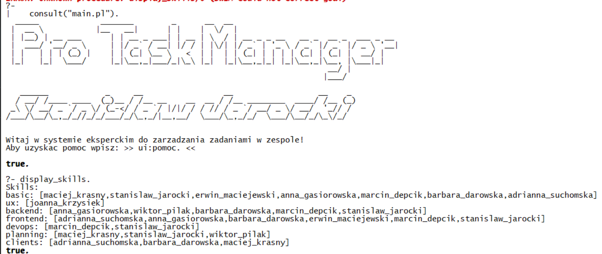

# Uruchomienie projektu
1. Pobierz wszystkie pliki.
2. Uruchom SWI prolog na pełnym ekranie.
3. Zmień lokalizację na folder, w którym znajdują się wszystkie pliki, np.:
```prolog
working_directory(_, "c:/users/stanislaw/Downloads/prolog_expert/").
```
4. Wczytaj wszystkie pliki poleceniem consult:
```prolog
consult("main.pl").
```
Na ekranie powinno wyświetlić się powitanie:


# Opis projektu
## Temat
System ma za zadanie przechowywać i wyświetlać informacje o zadaniach realizowanych przez zespół. Ma też doradzać w taki sposób, aby praca zespołu była zbalansowana i efektywna. Ma odciązyć osobę przydzielającą zadania i podejmować racjonalne decyjze w oparciu o dostępny czas wolny tych osób oraz ich umiejętności.

## Założenia systemu
1. System ma przechowywać informacje o zadaniach, takie jak:
   * Nazwa zadania
   * Osoba odpowiedzialna
   * Sprint, w którym zadanie jest realizowane
   * Status zadania (np. "w trakcie", "zakończone")
   * Priorytet zadania
2. System ma umożliwiać wyświetlanie wszystkich zadań.
3. System ma umożliwiać wyświetlanie zadań z obecnego sprintu (z uwzględnieniem przypisanej osoby).
4. System ma przechowywać informacje o sprintach oraz osobach w zespole (ich wymiarze zatrudnienia, umiejętnościach).
5. System ma sugerować komu przydzielić zadanie (kto ma potrzebne umiejętności).

## Informacje ogólne
* Język systemu (z pominięciem readme) - angielski.

## Moduły
* System podzielono na moduły:
  * Moduł główny (main)
  * Bazę wiedzy (database)
  * Moduł komunikacji z użytkownikiem (ui)
  * Moduł wnioskujący (expert)

## Autorzy
Stanisław Jarocki (jeden autor).

# Funkcje
2. Wyświetlanie wszystkich zadań.
2. Pomoc z informacją o dostępnych komendach - łatwość podejrzenia faktów lub obsługi systemu:

3. Wyświetlanie wszystkich dostępnych informacji w bazie danych w zbiorczy, wygodny sposób (np. wszystkie zadania, osoby, sprinty).

## Moduł wnioskujący
1. Wyświetlanie zadań z obecnego sprintu (z uwzględnieniem przypisanej osoby), np.:

2. Obliczanie czasu wolnego dla danej osoby w aktywnym sprincie.
3. Wybór najlepszej osoby do wykonania zadania (najwięcej czasu wolnego, umiejętności).
4. Proponowane zadania do wykonania dla danej osoby (z uwzględnieniem umiejętności).
5. Obliczanie czasu, jaka osoba ma przeznaczony na wykonanie zadań w obecnym sprincie.

### Przykładowe wykorzystanie
```prolog
display_skills. % Umiejętności wszystkich w zespole
display_active_sprint_tasks(_). % Wszystkie zadania w aktywnym sprincie
display_active_sprint_tasks(stanislaw_jarocki). % Zadania jednej osoby w aktywnym sprincie
active_sprint_occupancy(stanislaw_jarocki, Time). % Czas, jaki osoba ma już przeznaczony na zadania w aktywnym sprincie (w godzinach)
display_active_sprint_free_time(stanislaw_jarocki). % Czas wolny dla danej osoby (w godzinach)
display_working_time(stanislaw_jarocki). % Na jaką część etatu pracuje dana osoba
best_person_for_task(rpa_7, Person). % Odpowiednia do wykonania zadania o id rpa_7 (sprawdzenie w oparciu o umiejętności i czas wolny)
best_person_for_task(rpa_13, Person). % Odpowiednia osoba do wykonania zadania o id rpa_13 (sprawdzenie w oparciu o umiejętności i czas wolny)
display_best_tasks_for_person(stanislaw_jarocki). % Zadania, które najlepiej wykona dana osoba (sprawdzenie w oparciu o umiejętności)
```
### Prezentacja działania


